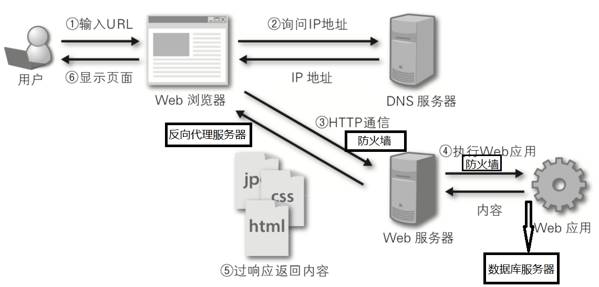
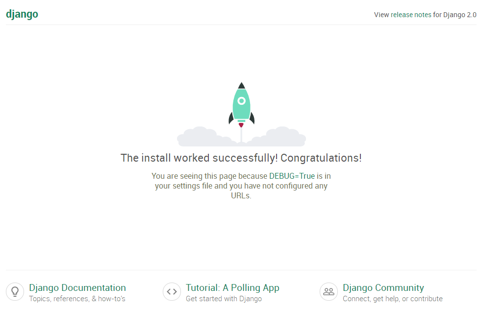

## 1. Django的基本概念

**(1) Django的含义** : 

​	Django是一个开放源代码的Web应用框架，由Python写成 ; 它遵守BSD版权，初次发布于2005年7月, 并于2008年9月发布了第一个正式版本1.0; 而且采用了MVC的软件设计模式，即模型M，视图V和控制器C ,  并对MVC架构提供了支持(MTV) . Python下有许多款不同的 Web 框架, 比较有名的有Flask、Django、Tornado、Pyramid、Bottle、Web2py、web.py等, 其中Django是重量级选手中最有代表性的一位, 许多成功的网站和APP都基于Django。

**(2) Web应用机制及相关术语** : 

**Web应用的工作流程 :** 

 

**相关术语 :** 

| 序号 | 术语          | 含义                                                         |
| :--: | ------------- | ------------------------------------------------------------ |
|  1   | **URL/URI**   | 统一资源定位符/统一资源标识符, 网络资源的唯一标识.                                                 协议://IP地址或域名:端口号 / 路径1 / 路径2 / 资源 |
|  2   | **域名**      | 与Web服务器地址对应的一个易于记忆的字符串名字                |
|  3   | **DNS**       | 域名解析服务，可以将域名转换成对应的IP地址                   |
|  4   | **IP地址**    | 网络上的主机的身份标识，通过IP地址可以区分不同的主机         |
|  5   | **HTTP**      | 超文本传输协议，构建在TCP之上的应用级协议，万维网数据通信的基础 |
|  6   | **反向代理**  | 代理客户端向服务器发出请求，然后将服务器返回的资源返回给客户端 |
|  7   | **Web服务器** | 接受HTTP请求，然后返回HTML文件、纯文本文件、图像等资源给请求者 |
|  8   | **Nginx**     | 高性能的Web服务器，也可以用作[反向代理](https://zh.wikipedia.org/wiki/%E5%8F%8D%E5%90%91%E4%BB%A3%E7%90%86)，[负载均衡](https://zh.wikipedia.org/wiki/%E8%B4%9F%E8%BD%BD%E5%9D%87%E8%A1%A1) 和 [HTTP缓存](https://zh.wikipedia.org/wiki/HTTP%E7%BC%93%E5%AD%98) |

**扩充** : **静态页面** : 页面中的内容是动态生成的.

​	   **动态页面** : 页面中的内容是用程序自动生成的.

​	   **web应用** : 基于浏览器来使用的应用程序, 只要有网络和浏览器就能够使用它. 如果应用程序升级那么用户不					

​			      用做任何特殊处理.

​	   **开发工具** : Ethereal --> Wireshark ;   HTTP(s) --> Charles ;   chrome --> 开发人员工具

​	   **冗余校验码** : 任何一个[散列函数](https://baike.baidu.com/item/%E6%95%A3%E5%88%97%E5%87%BD%E6%95%B0)都可以用于冗余检校验。最简单的冗余校验，叫作[校验和](https://baike.baidu.com/item/%E6%A0%A1%E9%AA%8C%E5%92%8C)，它包括[校验位](https://baike.baidu.com/item/%E6%A0%A1%E9%AA%8C%E4%BD%8D)、[校验码](https://baike.baidu.com/item/%E6%A0%A1%E9%AA%8C%E7%A0%81)以及[纵向冗余校验](https://baike.baidu.com/item/%E7%BA%B5%E5%90%91%E5%86%97%E4%BD%99%E6%A0%A1%E9%AA%8C)（[LRC](https://baike.baidu.com/item/LRC)，Longitudinal Redundancy Check）。其它类型的冗余校验包括[循环冗余校验](https://baike.baidu.com/item/%E5%BE%AA%E7%8E%AF%E5%86%97%E4%BD%99%E6%A0%A1%E9%AA%8C)（[CRC](https://baike.baidu.com/item/CRC)，Cyclic Redundancy Check）、水平冗余校验、竖直冗余校验以及Cryptographic Message Digest。 在通信领域中，冗余校验是消息中附加的用于错误检测与错误校正的数据。

**OSI参考模型** : 应用层 - 定义应用级协议 OICQ / QQ / HTTP / HTTPS / SMTP / FTP / Telnet / SSH

​			传输层 - 端到端可靠通信 TCP / UDP

​			网络层 - 寻址 + 路由  IP

​			物理链路层 - 分帧 + 校验

## 2. Django的安装

在windows下安装步骤:

(1) python --version    查看python版本(因为Django 1.11需要Python 2.7或3.4以上的版本；Django 2.0需要	

​					Python 3.4以上的版本)

```django
C:\Users\hanbo>python --version
Python 3.7.0
```

(2) mkdir  djname  创建文件夹

(3) cd djname  进入文件夹

(4) python -m venv venv  创建虚拟环境

(5) dir  查看venv是否存在

```django
C:\Users\hanbo\djname>python -m venv venv
C:\Users\hanbo\djname>dir
驱动器 C 中的卷没有标签。
卷的序列号是 823E-157E
C:\Users\hanbo\djname 的目录
2018/07/02  20:30    <DIR>          .
2018/07/02  20:30    <DIR>          ..
2018/07/02  20:30    <DIR>          venv
               0 个文件              0 字节
               3 个目录 81,364,017,152 可用字节
```

(6) cd venv   进入venv文件夹

(7) cd Scripts  进入Scripts文件夹

(8) dir  查看activate是否存在

(9) activate  激活虚拟环境      deactivate  退出虚拟环境

```django
C:\Users\hanbo\djname\venv\Scripts>activate
(venv) C:\Users\hanbo\djname\venv\Scripts>
```

(10) 退出到djname目录下 (用cd ..)

(11) python -m pip install -u pip   更新pip

```django
C:\Users\hanbo\djname\venv\Scripts>cd ..
C:\Users\hanbo\djname\venv>cd ..
C:\Users\hanbo\djname>python -m pip install -u pip
```

(12) pip install django  安装django

```
C:\Users\hanbo\djname>pip install django
Collecting django
  Downloading https://files.pythonhosted.org/packages/ab/15/cfde97943f0db45e4f999c60b696fbb4df59e82bbccc686770f4e44c9094/Django-2.0.7-py3-none-any.whl (7.1MB)
  100% |████████████████████████████████| 7.1MB 38kB/s
The script django-admin.exe is installed in 'd:\kfrj\python3\Scripts' which is not on PATH.
  Consider adding this directory to PATH or, if you prefer to suppress this warning, use --no-warn-script-location.
Successfully installed django-2.0.7 pytz-2018.5
```

(13) django-admin --version  查看django版本  ;   django-admin  查看admin可以跟那些命令

```
C:\Users\hanbo\djname>django-admin --version
2.0.7
```

(14) django-admin startproject hellodjango .    创建django项目

```
C:\Users\hanbo\djname>django-admin startproject hellodjango .
C:\Users\hanbo\djname>dir
 驱动器 C 中的卷没有标签。
 卷的序列号是 823E-157E
 C:\Users\hanbo\djname 的目录
2018/07/02  20:52    <DIR>          .
2018/07/02  20:52    <DIR>          ..
2018/07/02  20:52    <DIR>          hellodjango
2018/07/02  20:52               558 manage.py
2018/07/02  20:30    <DIR>          venv
               1 个文件            558 字节
               4 个目录 81,358,966,784 可用字节
```

(15) python manage.py runserver   启动服务器; 查看IP地址
        python manage.py runserver 127.0.0.1:8002 (默认8000端口 , 课设置指定端口)

```django
C:\Users\hanbo\djname>python manage.py runserver
Performing system checks...
System check identified no issues (0 silenced).
You have 14 unapplied migration(s). Your project may not work properly until you apply the migrations for app(s): admin, auth, contenttypes, sessions.
Run 'python manage.py migrate' to apply them.
July 02, 2018 - 20:54:53
Django version 2.0.7, using settings 'hellodjango.settings'
Starting development server at http://127.0.0.1:8000/
Quit the server with CTRL-BREAK.
```

(15) 浏览器进入127.0.0.1:8000或者localhost:8000 ; 显示如下界面说明Django安装成功

 

## 3.创建应用及修改配置

(1) python manage.py startapp appname    创建app应用

(2) 用pycharm进入命令窗口输入: python manage.py runserver 8000    启动服务器

(3) 更改配置 : LANGUAGE_CODE = 'zh-hans'   设置语言代码  ;    TIME_ZONE = 'Asia/chongqing'  设置时区


