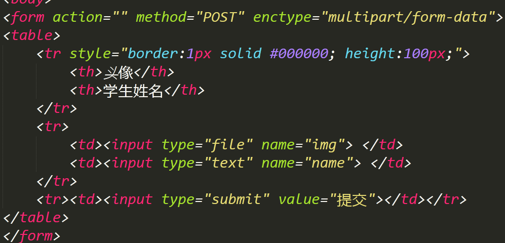

# 实现图片上传展示

### 前言
在很多开发功能里面都涉及到需要上传图片的地方，比如头像，或者封面图，或者内容中插入图片信息等，此文档就是来简单的实现一个图片文件上传并且展示的功能演示.  

### 练手题
题目：
1)  编写一个页面，用于提交数据，包括用户的名称，和头像图片
2)  编写一个方法，用户保存页面提交的用户名称和图片信息，将图片保存到指定的文件夹中
3）配置静态页面解析，在页面中展示出上传图片

#### 0. 安装处理图片的库
```python
pip install Pillow
```

#### 1. 配置上传图片的保存路径
在工程目录下的settings.py中配置media_url和media_root路径


在工程目录下的urls.py文件中配置media的目录为静态目录

先导入static的包：


设置media：


```python
urlpatterns += static(settings.MEDIA_URL, document_root=settings.MEDIA_ROOT)
```

#### 2. 定义模型

在模型中加入ImageFiled字段，并且指定上传的图片的保存路径


注意：在指定字段为ImageField类型的时候，要指定upload_to参数，表示上传的图片的保存路径

#### 3. 在页面中传递图片信息，和用户名信息



#### 4. 在服务端接受请求，并且保存图片信息

```python
注意：上传的时候，需要指定enctype=‘multipart/form-data’
```


#### 5. 页面中解析上传的图片信息

在数据库中用于保存图片的字段s_content的字段中存的是media下的upload/xxx.jpg地址，所以在页面解析的时候，需要加上media的目录，这样才能解析到图片在服务器中的路径


