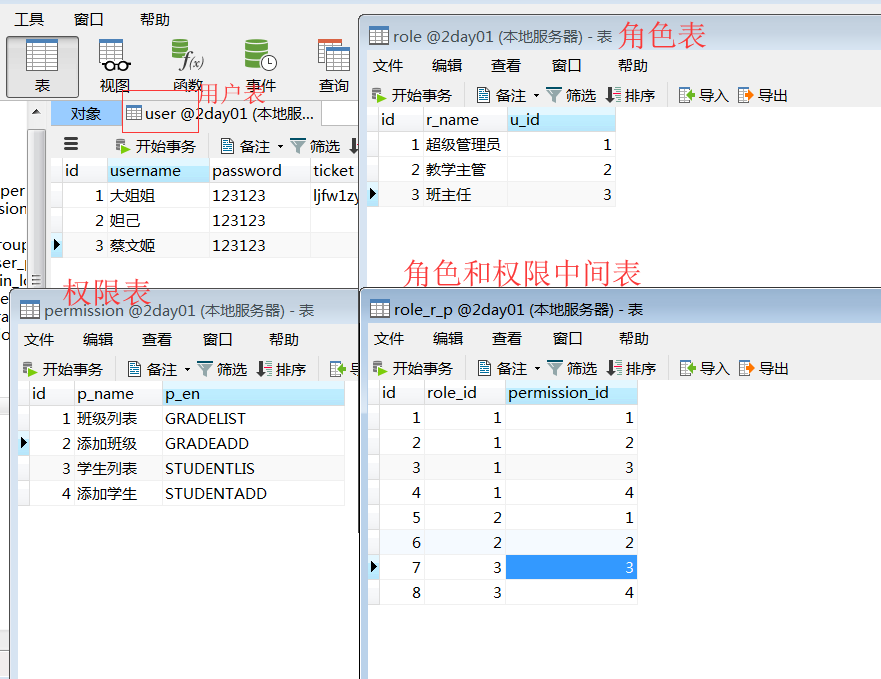

# 用户权限，用户角色

### 前言

RBAC（Role-Based Access Control，基于角色的访问控制）就是用户通过角色与权限进行关联。简单地说，一个用户拥有若干角色，每一个角色拥有若干权限。这样，就构造成“用户-角色-权限”的授权模型。在这种模型中，用户与角色之间，角色与权限之间，一般者是多对多的关系。


如下就是一个简单的权限设计模式，其中包含了用户表，角色表，权限表。


#### 1. 定义模型

用户表：

```python
class Users(models.Model):

    username = models.CharField(max_length=10)
    password = models.CharField(max_length=200)
    ticket = models.CharField(max_length=30)
    create_time = models.DateTimeField(auto_now_add=True)
    login_time = models.DateTimeField(auto_now=True)

    class Meta:
        db_table = 'user'
```


权限表：

```python
class RolePermission(models.Model):
    p_en = models.CharField(max_length=10)  # 权限英文名称
    p_name = models.CharField(max_length=10)  # 权限中文名称

    class Meta:
        db_table = 'role_per'
```

角色表：
```python
class Role(models.Model):
    r_name = models.CharField(max_length=10)  # 角色名称
    u = models.OneToOneField(Users)  # 关联的用户
    r_p = models.ManyToManyField(RolePermission)  # 多对多关联的权限

    class Meta:
        db_table = 'role'
```

#### 2. 简单的查询

```python
# 1) 查询某某用户具备那些权限
# 2) 判断某一个用户是否有某一个权限

from uAuth.models import Users, RolePermission, Role

def Test(request):
    user = Users.objects.get(id=1)
    u = user.role.r_p.filter(p_name='添加权限')
    print(u)
    return HttpResponse('查询成功')
```

#### 3. 插入数据库的数据




#### 4. 通过用户的权限，在页面中动态的加载菜单

在登录的方法中，我们定义了中间件，如果用户登录成功，我们会将当前登录的用户的user信息赋值给request.user，那么我们在页面中就可以通过user去获取到权限的信息了。

具体通过user获取permission的列表是以下写法：

```python
user.role.r_p.all
```

修改以下菜单页面：

```python
<dl class="system_log">
	
		
			<dt>
				 班级管理
			</dt>
			<dd>
				
				<a class="cks" href=""
					target="main">班级列表</a>
			</dd>
		
	
	
		
			<dd>
				
				<a class="cks" href=""
					target="main">班级添加</a>
			</dd>
		
	
</dl>
<dl class="system_log">
	
		
			<dt>
				 学生管理
			</dt>
			<dd>
				
				<a class="cks" href=""
					target="main">学生列表</a>
			</dd>
		
	
	
		
			<dd>
				
				<a class="cks" href=""
					target="main">添加学生</a>
			</dd>
		
	
</dl>
```